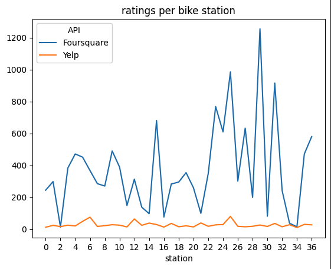
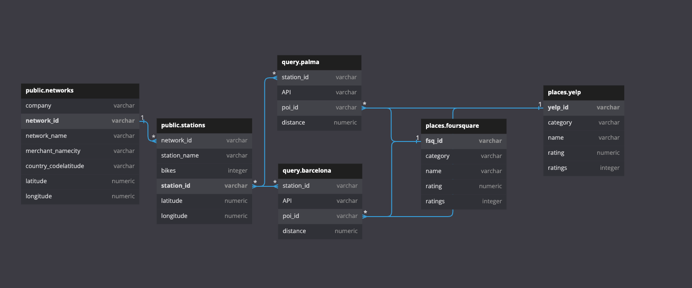

# Biketouring

## Project/Goals
- retrieve bikeloan data from citybik.es API
- retireve place of interest data from foursquare, and yelp APIs
- compare quality of data returns from foursquare and yelp
- create a database to hold data retrieved from APIs
- explore patterns between bikeloan and place of interest data

## Process
1. Explore APIs and their respective data output
2. Retrieve and format API data for analysis
3. Create database and insert retrieved data
4. Develop and automate data ETL into a pipeline
5. Conduct comparitive analysis on Yelp and Foursquare results
5. Exlpore patterns in data with statistical modelling

## Results
### Yelp vs Foursquare
For the bikestations in the city of Palma (Palma Majorca), Foursquare yielded a higher quality result set. The most notable metric was total ratings per station, visualized below:

### Database structure
The ideal database ERD for the extracted data was found to be the following:

### Statistical modelling
Exploration was conducted on the relationship between the average distance from a station to a place of interest and the amount of bikes at the station.
It was concluded that there is no significant relationship.

## Challenges 
- learning the protocol of multiple APIs
- creating a well structured ETL pipeline
- finding significant relationships

## Future Goals
### Simultaneous place of interest calls
- Threading the Foursquare and Yelp API calls into parallel execution would halve the overall call time
### Automated Yelp vs Foursquare comparison
- Creating a decision matrix with the quality metrics would allow the program to automatically pick which result set is best for downstream analysis
### Multivariate regression
- Using place of interest characteristics in a multivariate regression model to predict the number of bikes at a location could be valuable information for a bikeloan company looking to develop into a new area, or to compare against their current number of bikes at a location.
### Elimination of unnecessary specificity
- There is still some specificity in the pipeline that could be removed to make it entirely dependent on set variables from start to finish.
### Conversion to OOPs
- Best practice to prepare this pipeline for the development of an application would be to convert the code to an object oriented structure.
### App development
- An app could ask the user for an activity category, and return to them a bike station in their city within 1km(or any set distance) of high quality places in that activity category
